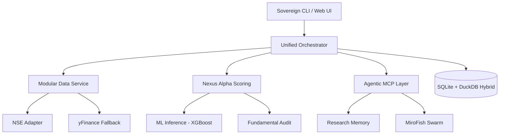

# Sovereign Research Terminal v4.0.0
## // The Sovereign Hybrid: Institutional Alpha Architecture //

[](https://www.python.org/downloads/)
[]()
[]()
[]()

Sovereign v4.0.0 represents a significant technical debt remediation and architectural leap. It integrates a **Modular Data Service (v4.0)**, a **Sigmoid-Normalized Nexus Alpha (v12.0)** scoring engine, and a **Unified CLI** for institutional-grade quantitative research across a universe of **2,000+ equity tickers**.

> [!IMPORTANT]
> **Sovereign is built for structural reliability.** v4.0.0 introduces a modular adapter layer, hard-fail security dependencies, and a robust Celery worker architecture that eliminates event-loop anti-patterns.

---

## 🏗️ Core Architecture: Modular & Resilient

The "God-Module" technical debt has been eliminated. All strategic logic is now centralized and decoupled:



### 1. Unified Operations (`sovereign_cli.py`)
The authoritative entry point for all engine operations, research, and maintenance.
- **`db`**: Schema initialization, integrity verification, and statistics.
- **`scan`**: Multi-universe scans (Quick, Microcap, Swarm, Value).
- **`ml`**: XGBoost training and SHAP explainability.
- **`sys`**: System-wide health diagnostics and market regime audits.

### 2. Agentic Intelligence (`sovereign_mcp.py`)
Powered by **FastMCP**, providing a state-of-the-art interface for AI agents:
- **Research Memory**: Progressive disclosure of past observations via `MemoryManager`.
- **MiroFish Swarm**: High-conviction multi-agent simulation for thesis validation.
- **Regime Awareness**: Hidden Markov Model (HMM) based regime detection.

### 3. Nexus Alpha v12.0 Scoring Engine
Every stock is audited across nine distinct vectors, dynamically weighted by **Market Regime**:
- **Growth (15%)**: 5Y Sales and EPS Expansion splines.
- **Quality (15%)**: ROE/ROCE + Asset-Light CFO/PAT validation.
- **Value (15%)**: Sigmoid-normalized sector-relative PE/PEG.
- **Momentum (10%)**: Composite RS + 52-Week High Proximity.
- **Risk (10%)**: Institutional F-Score floor + D/E Constraints.

---

## ⚡ Analytical Performance (DuckDB Optimized)

Sovereign leverages a **SQLite + DuckDB** hybrid approach for lightning-fast quantitative research.
- **Universe Coverage**: 2,000+ Tickers (NSE & Fallbacks).
- **Sorting Performance**: <5ms (Vectorized SIMD).
- **Zero Infrastructure**: Native C++ extensions attached to the SQLite file.

---

## 🚀 Operations & Deployment

### Quickstart (CLI First)

```bash
# 1. Initialize Environment
python sovereign_cli.py sys setup
python sovereign_cli.py db init

# 2. Run Health Diagnostic
python sovereign_cli.py sys health

# 3. Execute a Quick Scan
python sovereign_cli.py scan quick --smoke

# 4. Start Web API (Port 9005)
uvicorn main:app --reload --port 9005

# 5. Launch MCP Server
python sovereign_mcp.py
```

### Critical Environment Variables
| Variable | Purpose | Default |
|----------|---------|---------|
| `SOVEREIGN_API_KEY` | REQUIRED in production | None (Fails if missing) |
| `SOVEREIGN_ENV` | `production` / `local` | `local` |
| `OLLAMA_MODEL` | LLM model for thesis gen | `llama3.2:3b-instruct-fp16` |

---

## 🧪 Testing Suite

Sovereign enforces a strict **Testing Pyramid**:
1. **Unit Tests**: `pytest -m "not live"` — Logic and math validation.
2. **E2E Integration**: `pytest tests/e2e_scoring_pipeline.py` — Verifies full Fetch -> Score -> Result pipe.
3. **CI Pipeline**: GitHub Actions enforces Lint (Ruff), Types (Mypy), and Syntax Parsing.

---

## 🗂️ File Landscape (v4.0)
```
├── modules/
│   ├── adapters/          # Source-specific data fetchers
│   ├── strategies/        # Quantitative allocation logic
│   ├── normalization/     # Data cleaning and quality gates
│   ├── auth.py            # Security & API Key enforcement
│   ├── hybrid_scoring.py  # ML Meta-Model inference (XGBoost)
│   └── research_memory.py # Agentic observation persistence
├── scripts/
│   └── internal/          # Operational scripts (Invoked via CLI)
├── sovereign_cli.py       # AUTHORITATIVE ENTRY POINT
└── sovereign_mcp.py       # AGENTIC MCP INTERFACE
```

---
*Sovereign Terminal v4.0.0 — Built for structural alpha.*
