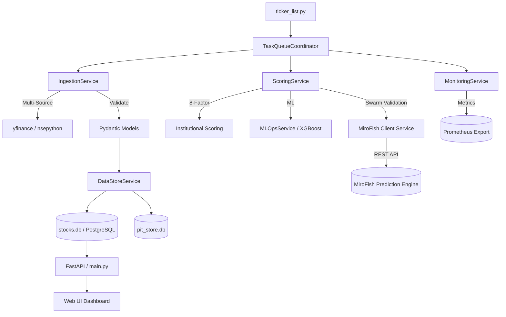

# 🏛️ Sovereign AI Trading Engine (v3.6 - Hardened)

An institutional-grade quantitative screening and scoring ecosystem designed for the Indian (NSE) and Global (US) markets. V3.6 focuses on architectural hardening, security-first data ingestion, and standardized API responses.

---

## 💎 Core Investment Philosophy

The Sovereign Engine is built on the **"Quality at a Reasonable Price" (QARP)** principle, enhanced by **Momentum Alpha**. It filters out 99% of the market noise to find stocks exhibiting high return on capital, robust cash flows, and accelerating earnings momentum.

## 🧠 Hardened Scoring Methodology

The heart of the system is the `calculate_institutional_score` function in `modules/scoring.py`. This is a dynamic, regime-aware weighting engine that adapts to market conditions.

### 1. Factor Normalization & Splines
- **Sigmoid Normalization**: Every raw metric is passed through a `sigmoid-based normalization` (0-100) to prevent step-cliff biases.
- **Smooth Graduation Splines**: Replaced binary disqualifiers with continuous splines. A stock with 15.1% ROE no longer scores 20 points higher than one with 14.9%.
- **Deterministic Tie-Breaking**: Implemented a symbol-hash based microscopic epsilon (5-decimal precision) to ensure stable rankings for stocks with identical fundamentals.

### 2. The 8-Factor Model
| Factor | Default Weight | Why it Matters |
| --- | --- | --- |
| **Sales Growth** | 0.15 | Verifies top-line demand expansion. |
| **ROE Stability** | 0.15 | Measures capital efficiency and moat strength. |
| **Cash conversion** | 0.10 | Detects accounting red flags (CFO/PAT). |
| **Valuation Gap** | 0.15 | Graham / PEG Margin of Safety. |
| **EPS Velocity** | 0.10 | Identifies profit inflection points. |
| **F-Score** | 0.10 | 9-Pt Piotroski business health. |
| **Leverage** | 0.10 | Debt/Equity penalties (Sect-weighted). |
| **Momentum** | 0.15 | Relative Strength and technical trend. |

---

## 🏗️ System Architecture

The trading engine follows a decoupled, **Service-Oriented Design** for maximum scalability.

### Swarm Intelligence Validation (MiroFish Integration)
Before taking a final position, high-conviction picks generated by the QARP/Momentum pipeline can be passed to our **Multi-Agent Simulation Layer**. Running `python scan_swarm.py --tickers ...` triggers a Swarm Intelligence debate via the MiroFish engine. Multiple AI agents parse contemporary news and fundamental data to battle-test the thesis, returning a finalized "Swarm Conviction Score."

---

## 🛡️ Hardening & Reliability (v3.6)

Recent architectural improvements for production-grade stability:
- **Parameterized SQL Foundation**: Replaced vulnerable string interpolation in background price updaters with secure parameterized queries.
- **Refined Estimates Fallback**: Fixed critical indentation bugs in `estimates.py` ensuring self-computed estimates correctly trigger when manual analyst consensus is missing.
- **Standardized API Responses**: API endpoints migrated to use `HTTPException` with proper status codes (404 for missing stocks, 400 for regime violations), improving client-side error handling.
- **Database Consistency**: Implemented `sqlite3.Row` factory for all historical data fetches to prevent latent tuple-access TypeErrors.
- **Shadowing Removal**: Gutted redundant technical indicator definitions in `screener.py` to ensure imports from `modules/technicals.py` are the single source of truth.

---

## 📡 Observability & Monitoring

The engine is now fully instrumented for production-grade observability:
- **Prometheus Metrics**: High-resolution business metrics exposed via `/metrics`.
- **Latency Tracking**: Every Celery task is instrumented with timers to monitor pipeline throughput and data ingestion lag.
- **Data Quality (DQ) Guard**: Real-time tracking of fundamental data coverage and LLM thesis fallbacks.

---

## 🛠️ Operational CLI (`sovereign-cli.py`)

- `health`: Run deep-forensic checks on env, deps, and connectivity.
- `ml-ops`: Monitor and update ML models (`--retrain`, `--update`).
- `tune-db`: One-click optimization for all SQLite databases.
- `db-stats`: Instant table audit and health overview.
- `regime`: Real-time diagnostic of market regime voting.

---

## ⚙️ Advanced Configuration (`config.py`)

| Key | Default | Purpose |
| --- | --- | --- |
| `DATABASE_URL` | env | Dynamic DB routing (PostgreSQL/SQLite). |
| `OLLAMA_URL` | env | Remote LLM gateway for thesis generation. |
| `CORS_ALLOWED_ORIGINS` | env | Comma-separated trusted web origins. |
| `MAX_SECTOR_EXPOSURE` | 0.25 | Prevents portfolio over-indexing. |
| `HARD_KILL_SWITCH_VIX` | 35.0 | Stops execution during extreme volatility. |

---

## 🚀 Getting Started

1. **Install Dependencies**: `pip install -r requirements.txt`
2. **Setup**: Configure `DATABASE_URL` in `.env` if using Postgres (SQLite works out of the box).
3. **Health Check**: Run `python sovereign-cli.py health`.
4. **Scan**: Execute `python main.py` and access the dashboard at `:9005`.

---
*Institutional-grade quantitative excellence on Indian and Global markets.*
